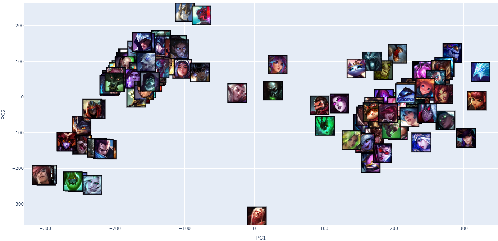

# Análise de Campeões League of Legends

Projeto de análise de dados dos campeões do League of Legends, extrayindo informações da API oficial do Ddragon e realizando análises exploratórias com visualizações 2D e 3D.

## 📋 Descrição

Este projeto coleta dados estatísticos de todos os campeões do League of Legends e realiza análises dimensionais dos atributos, utilizando técnicas como PCA (Principal Component Analysis) para visualização e exploração dos dados.

## 📂 Estrutura do Projeto

```
LoL/
├── get_data.py           # Script para coleta e transformação de dados
├── main.ipynb            # Notebook principal com análises e visualizações
├── champions_db.feather  # Banco de dados de campeões (formato Feather)
└── images/               # Pasta com imagens dos campeões e gráficos
```

## 🛠️ Funcionalidades

### `get_data.py`

- Coleta dados da API oficial do Ddragon
- Transforma dados JSON em DataFrame pandas
- Extrai estatísticas dos campeões (HP, Armadura, Velocidade de Ataque, etc.)
- Baixa imagens dos campeões
- Salva dados em formato Feather para acesso rápido

### `main.ipynb`

- Carregamento e exploração dos dados
- Análises exploratórias com pandas
- Normalização de dados com diferentes escaladores
- Aplicação de PCA para redução dimensional
- Visualizações 2D e 3D dos dados

## 📊 Gráficos e Visualizações

### Gráficos 2D



### Gráficos 3D

📦 Dependências

<!--  -->


- `pandas` - Manipulação e análise de dados
- `matplotlib` - Visualizações
- `scikit-learn` - Aprendizado de máquina (PCA, Escaladores)
- `requests` - Requisições HTTP
- `pyarrow` - Formato de arquivo Feather

## 🚀 Como Usar

1. **Coleta de dados:**

   ```bash
   python get_data.py
   ```

   Isso irá baixar os dados dos campeões, transformá-los em um DataFrame e salvar em `champions_db.feather`, além de baixar as imagens.
2. **Análise e visualizações:**
   Abra `main.ipynb` em um Jupyter Notebook para explorar os dados e visualizar os gráficos.

## 📁 Imagens

A pasta `images/` contém imagens dos campeões do League of Legends usadas para referência visual e potencial uso em análises.

## 🔗 Referências

- [API Ddragon do League of Legends](http://ddragon.leagueoflegends.com/)
- Versão de dados utilizada: 14.8.1

---

**Nota:** Este é um projeto educacional de análise de dados com foco em visualização e exploração de atributos de personagens.
